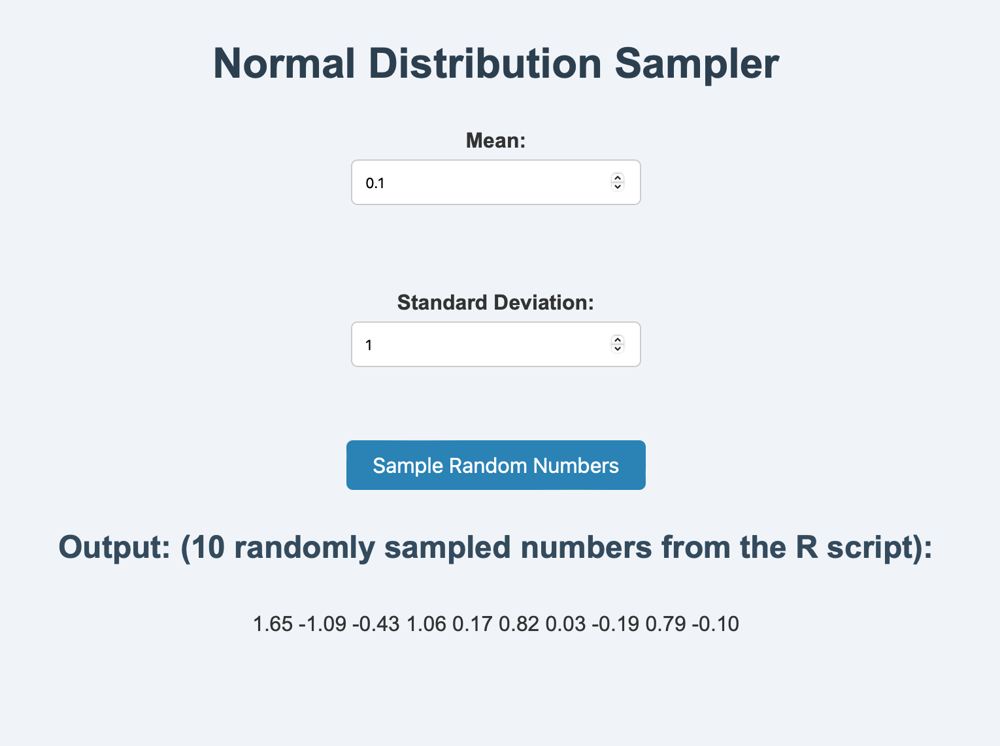

# Hello World in WebR

To get started, download or pull this repo. Also, make sure you have [Python3 installed](https://www.python.org/downloads/). You don't need to write Python code for this to work; we just need Python to a line of Terminal code that will allow you to see this test code locally in your browser.

In the terminal, navigate this repo stored and run

```
python3 -m http.server
```

If you have problems with the commands above, try:

```
python -m http.server
```

Now, open a web browser (I've worked mostly with Chrome) and type "http://localhost:8000" into the URL bar. You should now see a webpage like this:


